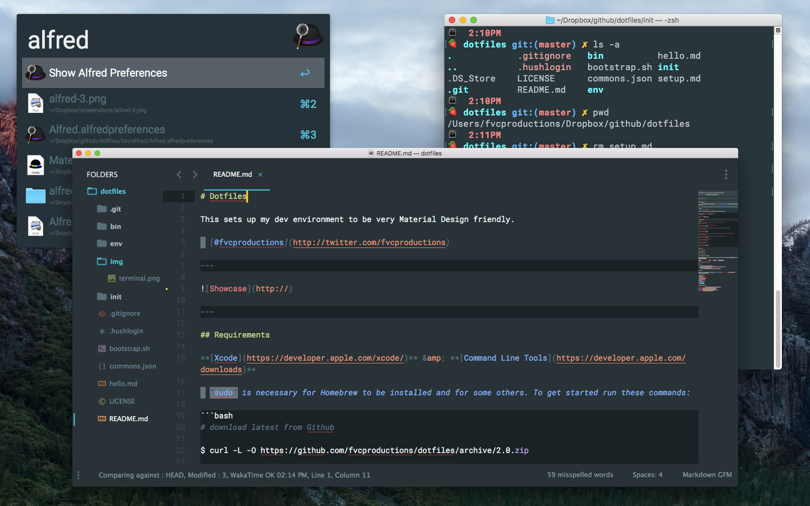
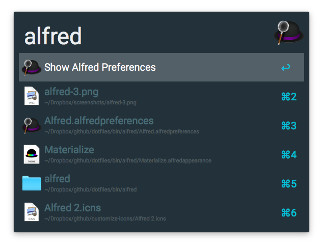
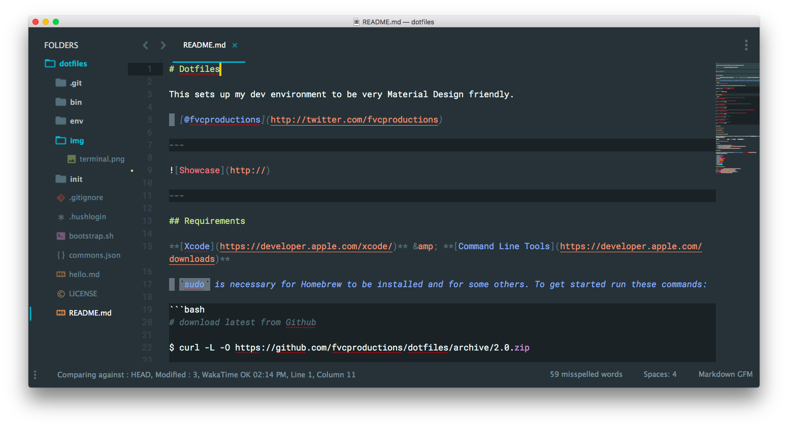
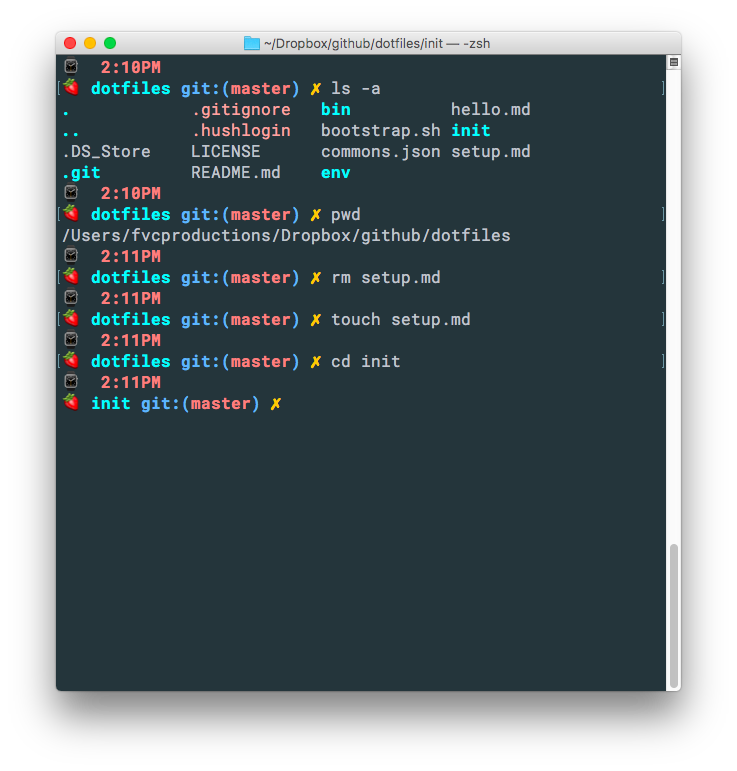

# Dotfiles

> This sets up my dev environment to be very Material Design friendly.



## To-Do

- make all online apps into casks
    + [Airtable](https://airtable.com/mac)
    + [Zeit Now]()
    + WakaTime Plugins
        + [Sketch](https://github.com/wakatime/sketch-wakatime/releases/latest)

## Requirements

**[Xcode](https://developer.apple.com/xcode/)** &amp; **[Command Line Tools](https://developer.apple.com/downloads)**

The `sudo` command is necessary for Homebrew to be installed and for some others.

### To get started run these commands...

```bash
# download latest version from Github
curl -L -O https://github.com/fvcproductions/dotfiles/archive/3.0.zip

# unzip the file and move to my GitHub folder inside of Dropbox
unzip 3.0.zip && mv dotfiles-3.0 ~/Dropbox/github/dotfiles

# run bootstrap!
sh ~/Dropbox/github/dotfiles/bootstrap.sh
```

## Initialize Dotfiles

```bash
# Installs npm and certain npm packages
sh ~/Dropbox/github/dotfiles/init/.npm

# Installs casks and taps to caskroom-versions
sh ~/Dropbox/github/dotfiles/init/.casks

# Installs Sublime Text 3, Package Control, theme, and packages
sh ~/Dropbox/github/dotfiles/init/.subl

# Installs Atom and Packages
sh ~/Dropbox/github/dotfiles/init/.atom

# Installs oh-my-zsh, terminal theme, oh-my-zsh theme and configs
sh ~/Dropbox/github/dotfiles/init/.shell

# OSX optimal awesome settings
sh ~/Dropbox/github/dotfiles/init/.osx

# Installs fonts for coding and docs
sh ~/Dropbox/github/dotfiles/init/.fonts

# Guide that helps you setup your git configuration and ssh-key setup for Github and Bitbucket
sh ~/Dropbox/github/dotfiles/init/.gituser
```

## Atom


```bash
# move .atom to .dotfiles
mv ~/.atom/ ~/Dropbox/github/dotfiles/

# create a symlink to the directory inside dotfiles
ln -s ~/Dropbox/github/dotfiles/.atom/ ~/.atom
```

## Alfred 3



## Sublime Text 3

```bash
cd ~/Library/Application\ Support/Sublime\ Text\ 3/Packages/
rm -r User
ln -s /Users/fvcproductions/Dropbox/GitHub/dotfiles/bin/subl/User/
```



## Terminal and Z-shell Theme

Once the theme has loaded, you might want to replace the shell's startup command in `Preferences` under `Profiles > Shell Tab`:

`login -fpql fvcproductions /bin/zsh` to `login -fpql YOURNAME /bin/zsh`



## Theming

Accents are as follows in accordance to the [ST3 Material Theme by equinusocio](https://github.com/equinusocio/material-theme):

- Lime: #7CB342
- Purple: #AB47BC
- Red: #E57373
- Red Orange: #F74A50
- Orange: #FF7042
- Yellow: #FFA000
- Indigo: #5C6BC0
- Pink: #FF4081
- Blue: #2979FF
- Cyan: #00BCD4

## Credits

- [@fvcproductions](https://github.com/fvcproductions/)
- [@mathiasbynens](https://github.com/mathiasbynens/dotfiles)
- [@necolas](https://github.com/necolas/dotfiles)
- [@cowboy](https://github.com/cowboy/dotfiles/)
- [@ptb](https://github.com/ptb/Mac-OS-X-Lion-Setup)
- [@pongstr](https://twitter.com/pongstr)

## Donations

> Feed me... 🍕

[](http://paypal.me/fvcproductions)

```txt
 ******** **      **   ******
/**///// /**     /**  **////**
/**      /**     /** **    //
/******* //**    ** /**
/**////   //**  **  /**
/**        //****   //**    **
/**         //**     //******
//           //       //////

+-+-+-+-+-+-+-+-+
|D|o|t|f|i|l|e|s|
+-+-+-+-+-+-+-+-+
```
